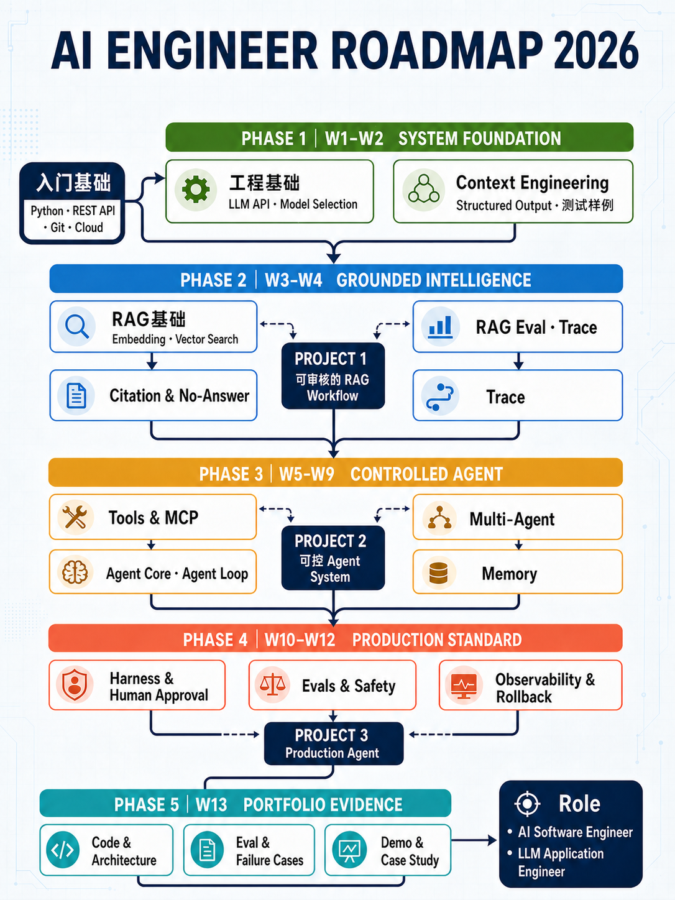
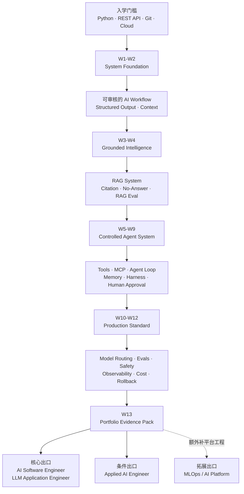

# 2026 美国 AI Engineer 学习与项目 Roadmap

> 课程结合版｜AI Engineer Bootcamp Cohort 07 工作稿
>
> 核验日期：2026-09-02
>
> 目标岗位：AI Software Engineer / LLM Application Engineer / 应用侧 Applied AI Engineer

## 使用边界

- 本 Roadmap 不是“零基础转行承诺”，适合已经具备 Python、API、Git 和基本云平台经验的技术学习者。
- “13 周”采用 2026-09-10 AI Engineer 实战公开课提供的最新项目路径口径；当前课程资料仍同时存在 12 周、13 周、不同 Live 数量等表述，对外发布前必须由课程运营统一确认。
- 完成课程和项目可以形成求职证据，但不能替代企业工作年限、学历、英语沟通、工作授权或真实生产经验，也不保证面试或 Offer。
- Roadmap 面向应用与生产交付侧 AI Engineer，不等同于 Research Scientist、Data Scientist、AI Security Engineer 或 AI Product Manager 的完整培养路径。

## 一句话定位

不是从 Prompt 学到 Demo，而是沿着一套 Agent System 持续升级：

**工程底座 → Context → RAG → Tools/MCP → Agent → Memory/Harness → Evals/Safety → Production Evidence**

## 总览

## 13 周主路线

| 周次 | 课程对应 | 核心能力 | 同一个 Agent 项目的升级 | 必须留下的证据 |
|---|---|---|---|---|
| Pre-work | 入学前置 | Python、REST API、JSON、Git、AWS基础、Secret管理 | 建好代码仓库、环境配置与最小 API 服务 | 可运行代码、README、测试命令、首次部署记录 |
| W1 | Phase 1 Foundation Layer | LLM API、Transformer基本认知、模型选择、成本意识 | 接入模型并定义第一个业务任务 | Model Decision Record：为什么选这个模型 |
| W2 | Phase 2 Context Engineering | System Prompt、Context分层、Structured Output、JSON Schema | 把自由聊天改成可审核的结构化 Workflow | 输入/输出契约、失败样例、首版测试集 |
| W3 | Phase 3 RAG 上半段 | Embedding、Chunking、Vector Search、检索管道 | 让 Agent 能基于企业资料回答 | 检索结果、Citation、No-Answer策略 |
| W4 | Phase 3 RAG 下半段 | GraphRAG、Hybrid Retrieval、RAGAS、LangSmith/Langfuse、Bedrock | 让回答可评测、可追踪，并部署第一版 RAG | RAG Eval 报告、Trace、延迟与成本基线 |
| W5 | Phase 4 Capability Layer | Function Calling、Tool Use、MCP Server、Browser/Computer Use | 给 Agent 接入受控工具 | Tool Schema、MCP Server、权限白名单、错误返回 |
| W6 | Phase 5 Agent Core | ReAct、Agent SDK、Planning、Reflection、Agentic RAG | 建立 Agent Loop 和停止条件 | Agent状态图、最大步数、超时与重试策略 |
| W7 | Phase 6 Multi-Agent & Orchestration | LangGraph、A2A、多 Agent 路由、Agent Ops | 只在任务确实需要时拆分多个 Agent | 编排图、路由理由、单 Agent 对照实验 |
| W8 | Phase 7 Memory System | STM/LTM、Session、Mem0、Context Compression | 加入有边界的短期与长期记忆 | Memory Policy、清除机制、隐私与串话测试 |
| W9 | Phase 8 Harness Engineering | Tool Loop、Hooks、Skills、Sandbox、Human-in-the-Loop | 把 Agent 变成可控 Harness | Hook日志、人工审批点、Sandbox边界、恢复流程 |
| W10 | Phase 9 Model Layer | Model Routing、Open-weight Model、Ollama、Fine-tuning选修 | 按质量、延迟和成本进行模型路由 | Model Benchmark；Fine-tuning仅在有证据时使用 |
| W11 | Phase 10 Observability & Evals | Eval Dataset、Graders、LLM-as-a-Judge、Regression | 给核心任务建立持续评测 | Eval Pipeline、回归门槛、版本对比报告 |
| W12 | Phase 10 Safety & Production Ops | Guardrails、Prompt Injection、Red Team、Monitoring、Fallback、Rollback | 加固系统并完成生产部署 | Threat Model、Red-team结果、Dashboard、Rollback演练 |
| W13 | Capstone / P3 Handoff | 架构表达、Demo、复盘、CV项目表达 | 冻结一个可演示、可解释、可复现的 Agent System | Evidence Pack、Demo、Case Study、STAR素材 |

## 5 次系统升级

### Upgrade 1｜System Foundation

**课程覆盖：** Phase 1–2

**目标：** 从“能调用模型”升级成“输出可控、结果可审核的 AI Workflow”。

完成标准：

- Python 服务可以稳定调用模型 API。
- 输入、输出和错误均有明确 Schema。
- Prompt 与 Context 有版本记录，不散落在代码里。
- 至少有一组正常、边界和失败测试样例。

### Upgrade 2｜Grounded Intelligence

**课程覆盖：** Phase 3

**目标：** 从“模型凭记忆回答”升级成“基于资料回答，并能指出依据”。

完成标准：

- 完成文档处理、Embedding、检索、生成的端到端 Pipeline。
- 回答包含 Citation；证据不足时执行 No-Answer。
- 使用固定测试集评估检索与回答质量。
- 保存 Trace、延迟、Token和成本基线。

### Upgrade 3｜Controlled Agent System

**课程覆盖：** Phase 4–8

**目标：** 从“RAG问答”升级成“能调用工具，但有权限、停止条件和人工审批的 Agent”。

完成标准：

- Tool Calling 使用清晰的输入输出 Schema。
- MCP Server 不默认暴露全部工具或数据。
- Agent Loop 有最大步数、超时、重试和停止条件。
- 高风险操作进入 Human Approval，而不是自动执行。
- Memory 有保存、读取、隔离、过期和删除规则。
- Harness 保存关键 Hook、Tool Call、Approval和Failure记录。

### Upgrade 4｜Production Standard

**课程覆盖：** Phase 9–10

**目标：** 从“现场能跑”升级成“上线后可评测、可监控、可降级、可回滚”。

完成标准：

- 模型选择有质量、速度和成本对照，不追新模型名称。
- 关键任务有 Eval Dataset、Grader和回归门槛。
- 监控质量、错误、延迟、Token、成本和工具调用。
- 完成 Prompt Injection、越权和数据泄露测试。
- 模型或 Prompt 更新失败时可以 Fallback / Rollback。

### Upgrade 5｜Portfolio Evidence

**课程承接：** Week 13 + P3职业/项目孵化

**目标：** 把“我学过这些技术”变成“我能解释一个系统为什么这样设计”。

求职证据包至少包含：

1. 可运行代码仓库与清晰 README。
2. 一张系统架构图和关键 Architecture Decision Records。
3. Eval Dataset、指标定义和版本对比结果。
4. 至少三个失败案例及修复过程。
5. Trace、成本和延迟截图或导出记录。
6. 安全边界、Human Approval与Rollback说明。
7. 可演示部署或可复现的本地运行方式。
8. 一页 Case Study、简历 bullets 和面试 STAR 素材。

## 与美国岗位要求的映射

| 美国岗位高频能力 | 当前课程覆盖 | Roadmap处理 |
|---|---|---|
| Python、API、Git、Cloud | Phase 1 + Pre-work | 入学闸门；不能只靠课堂临时补齐 |
| Context与Structured Output | Phase 2 | W2形成可审核 Workflow |
| RAG、Citation、No-Answer | Phase 3 | W3–W4形成 Grounded System |
| Tools、Agent、MCP | Phase 4–6 | W5–W7形成受控执行系统 |
| Memory与Harness | Phase 7–8 | W8–W9强调隔离、Hooks与Human Approval |
| Evals与Observability | Phase 3、6、10 | W4建立基线，W11–W12形成持续评测 |
| Safety、Latency、Cost、Rollback | Phase 9–10及部署内容 | W10–W12集中验收 |
| Production Project Evidence | Quest、ISA、Capstone、P3 | W13统一沉淀Evidence Pack |

## 需要强化或另设专项的部分

这些能力在美国岗位中常见，但不应仅凭课程出现过相关关键词就声称“完整掌握”：

- **后端工程深度：** 数据库、异步任务、并发、缓存、服务边界和系统设计。
- **测试与交付：** Unit / Integration / E2E、CI/CD、版本发布和事故处理。
- **平台工程：** Kubernetes、Terraform、分布式系统、容量管理和SRE；更适合MLOps拓展路径。
- **企业交付：** 旧系统集成、权限治理、跨团队沟通和变更管理；Applied AI岗位通常还要求既有工作经验。
- **模型研究：** PyTorch/JAX深度、大规模训练、CUDA、论文复现；属于ML/Research分支，不是主路线硬塞内容。

## 岗位出口

### 核心出口

- AI Software Engineer
- LLM Application Engineer

课程与Roadmap覆盖度最高，但仍要求学员原本具备可靠的软件工程基础。

### 条件出口

- Applied AI Engineer
- Forward Deployed AI Engineer

除技术能力外，通常还看企业交付、客户沟通、复杂集成和多年工作经验。Roadmap不能替代这些履历。

### 拓展出口

- MLOps Engineer
- AI Platform / ML Infrastructure Engineer

需要额外补充 Kubernetes、Terraform、CI/CD、分布式系统、网络、SRE 和模型平台专项。

### 不作为本课直接出口

- AI Research Scientist
- Data Scientist / Applied Scientist
- AI Security Engineer
- AI Product Manager

这些方向分别需要研究、统计、安全或产品管理的独立职业底座。

## 对外版可使用的核心文案

> 13周，不是做13个互不相关的AI Demo。
>
> 你会持续升级同一个Agent项目：先让它有可靠的Context，再接入RAG和Citation；然后加入Tools、MCP、Memory与Human Approval；最后补齐Evals、Observability、Safety和Rollback。
>
> 毕业时留下的不只是一个聊天页面，而是一套有代码、有架构、有评测、有运行记录和失败证据的Agent System。

## 发布前确认清单

- [ ] 课程运营确认最终周期是12周还是13周。
- [ ] 统一Theory Live、Practice Live、总Live数量和P3周期口径。
- [ ] 确认“同一个Agent项目”是所有学员统一项目，还是每人/每组选题不同但沿用同一升级框架。
- [ ] 确认W1–W13与实际教学排期的对应关系。
- [ ] 确认P3是否包含在13周内，还是独立于技术课程之后。
- [ ] 删除或改写任何“完成课程即可胜任岗位”的结果暗示。
- [ ] 对外发布前重新核验美国岗位页及课程页面。

## 事实来源

### 课程内部来源

- `curriculum/ai-engineer-bootcamp/public/outline.json`
- `curriculum/ai-engineer-bootcamp/REALITY_CHECK_2026-09-01.md`
- 2026-09-10《AI Engineer实战公开课：现场搭建一个可控的AI Agent》活动资料

### 美国岗位官方来源（2026-09-02核验）

- OpenAI — Applied AI Engineer, Enterprise: https://openai.com/careers/applied-ai-engineer-enterprise-san-francisco/
- OpenAI — AI Systems Engineer, Codex Agents: https://openai.com/careers/ai-systems-engineer-codex-agents-san-francisco/
- Anthropic — Applied AI Engineer, Enterprise Tech: https://job-boards.greenhouse.io/anthropic/jobs/5057647008
- Anthropic — AI Engineer, GTM Claudification: https://job-boards.greenhouse.io/anthropic/jobs/5390966008
- Amazon — AI/ML Engineer: https://amazon.jobs/en/jobs/10513234/ai-ml-engineer-amazon-global-data-center-ops-central-insight-and-analytics-team
- NVIDIA — Senior Software Engineer, Generative AI Systems: https://nvidia.wd5.myworkdayjobs.com/en-US/NVIDIAExternalCareerSite/job/Senior-Software-Engineer--Generative-AI-Systems_JR2018830
